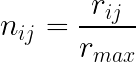
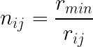
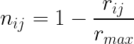
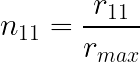
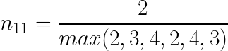
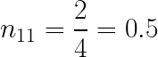
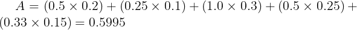

# Simple Additive Weighting (SAW)

Multi Criteria Decision Analysis (MCDA) atau dikenal juga sebagai Multi Criteria Decision Making (MCDM) merupakan suatu metode yang digunakan untuk menyelesaikan permasalahan berkaitan dengan berbagai macam alternatif dalam pengambilan keputusan. Simple Additive Weighting (SAW) merupakan salah satu metode dalam MCDM.

Kita akan melakukan studi kasus untuk memahami bagaimana cara kerja SAW. Disini kita memiliki dataset sebagai berikut:


```python
from dataset import data, data_converted, decision_matrix
```


```python
data.set_index('name')
```


<table border="1" class="dataframe">
  <thead>
    <tr style="text-align: right;">
      <th></th>
      <th>clockspeed</th>
      <th>core_processor</th>
      <th>price</th>
      <th>ram</th>
      <th>storage</th>
    </tr>
    <tr>
      <th>name</th>
      <th></th>
      <th></th>
      <th></th>
      <th></th>
      <th></th>
    </tr>
  </thead>
  <tbody>
    <tr>
      <th>Laptop A</th>
      <td>2.6</td>
      <td>2</td>
      <td>4199000</td>
      <td>4</td>
      <td>256</td>
    </tr>
    <tr>
      <th>Laptop B</th>
      <td>3.8</td>
      <td>4</td>
      <td>8799000</td>
      <td>8</td>
      <td>256</td>
    </tr>
    <tr>
      <th>Laptop C</th>
      <td>4.0</td>
      <td>8</td>
      <td>14999000</td>
      <td>8</td>
      <td>512</td>
    </tr>
    <tr>
      <th>Laptop D</th>
      <td>2.8</td>
      <td>2</td>
      <td>4849000</td>
      <td>4</td>
      <td>256</td>
    </tr>
    <tr>
      <th>Laptop E</th>
      <td>4.2</td>
      <td>4</td>
      <td>11499000</td>
      <td>8</td>
      <td>512</td>
    </tr>
    <tr>
      <th>Laptop F</th>
      <td>3.7</td>
      <td>4</td>
      <td>7500000</td>
      <td>8</td>
      <td>512</td>
    </tr>
  </tbody>
</table>
Dataset tersebut merupakan data informasi mengenai spesifikasi laptop. Dalam hal ini kita ingin membuat sistem pendukung keputusan yang membantu kita dalam memilih mana laptop yang sebaiknya kita beli sesuai dengan kriteria yang nantinya akan kita tentukan.

### Menentukan kriteria
Kriteria merupakan variable yang menentukan atribut apa saja yang berpengaruh dalam pengambilan keputusan. Kriteria-kriteria ini nantinya akan kita tentukan apakah dia masuk sebagai atribut yang bernilai **cost** atau **benefit**.

Mengacu pada dataset diatas, kriteria yang terbentuk diantaranya:
- clockspeed
- core_processor
- price
- ram
- storage

Setiap kriteria yang ada, akan kita berikan nilai dengan rentang tertentu. Kemudian penentuan **cost** ataupun **benefit** bergantung pada bagaimana karakteristik dari kriteria tersebut. Apabila terdapat suatu kriteria dan jika semakin kecil nilai tersebut semakin bagus, maka kriteria tersebut kita tetapkan sebagai **cost**. Begitu pula sebaliknya, apabila terdapat suatu kriteria dan apabila semakin besar nilai dari kriteria tersebut semakin bagus, maka kita tetapkan sebagai **benefit**.

#### Kriteria ```clockspeed``` 

Pada dasarnya penentuan nilai kriteria berdasarkan pada preferensi masing-masing. Dalam hal ini, kita akam mencoba membuat nilai untuk kriteria clockspeed seperti berikut:

|clockspeed|nilai|
|:---------|----:|
| 1.0 - 1.9 GHz | 1 |
| 2.0 - 2.9 GHz | 2 |
| 3.0 - 3.9 GHz | 3 |
| > 3.9GHz | 4 |

Kita ketahui bahwa semakin besar nilai dari ```clockspeed``` maka akan semakin bagus, oleh karenanya ```clockspeed``` kita tetapkan sebagai **benefit**.

#### Kriteria ```core_processor```
|core_processor|nilai|
|:-------------|----:|
| 2 | 1 |
| 4 | 2 |
| 6 | 3 |
| > 6 | 4 |

Semakin banyak jumlah core dari processor, performa dari laptop akan semakin bagus, sehingga bisa disimpulkan bahwa jumlah core processor semakin banyak semakin bagus, oleh karenanya ```core_processor``` kita tetapkan sebagai **benefit**.

#### Kriteria ```price```
|price|nilai|
|:----|----:|
| Rp.1.000.000 - Rp.4.999.999 | 1 |
| Rp.5.000.000 - Rp.9.999.999 | 2 |
| Rp.10.000.000 - Rp.14.999.999 | 3 |
| > Rp.14.999.999 | 4 |

Sebagai seorang pelanggan, tentu saja kita menginginkan sebuah laptop dengan performa yang bagus tetapi dengan harga semurah mungkin. Artinya semakin murah harga laptop, maka akan semakin bagus. Berdasarkan hal tersebut kita akan menetapkan ```price``` sebagai **cost**.

#### Kriteria ```ram```
|ram|nilai|
|:--|----:|
| 2GB - 4GB | 1 |
| 5GB - 8GB | 2 |
| 9GB - 16GB | 3 |
| > 16GB | 4 |

Dengan ram yang besar, tentu saja performa laptop akan semakin baik, oleh karenanya pelanggan akan lebih suka apabila memiliki laptop dengan ram yang lebih besar. Oleh karenanya kita tetapkan ```ram``` sebagai **benefit**.

#### Kriteria ```storage```
|storage|nilai|
|:------|----:|
| < 257GB | 1 |
| 257GB - 512GB | 2 |
| 513GB - 1024GB | 3 |
| > 1024GB | 4 |

Semakin besar storage, maka pemilik laptop dapat menyimpan file secara lebih leluasa, oleh karenanya kita tetapkan ```storage``` sebagai **benefit** karena semakin besar ukuran dari storage maka akan semakin bagus.

### Menentukan Bobot
Setelah kita memperoleh seluruh nilai dari kriteria, tahap selanjutnya yaitu kita menentukan bobot untuk setiap kriteria. 
Pada dasarnya penentuan pembobotan ini dapat dilakukan dengan berbagai cara. Menurut Odu (2019), pembobotan diklasifikasikan menjadi 3 kategori, diantaranya: 
- pembobotan subjektif
- pembobotan objektif
- pembobotan terintegrasi

Untuk mempermudah dalam implementasi kali ini, penentuan bobot dilakukan dengan menggunakan pembobotan subjektif dengan metode alokasi poin. Penggunaan metode alokasi poin ini dikarenakan implementasinya yang mudah dan penentuan bobot didasarkan pada prioritas dari kriteria. Semakin besar nilai bobotnya berarti semakin penting kriteria tersebut.

|kriteria|bobot|konversi|
|:-------|:---:|-------:|
| clockspeed | 20 | 0.20 |
| core_processor | 10 | 0.10 |
| price | 30 | 0.30 |
| ram | 25 | 0.25 |
| storage | 15 | 0.15 |
|**total**| **100** | **1** |

### Membuat Matrix Keputusan
Dalam matrix keputusan (decision matrix) ini kita mengubah nilai dari data dari masing-masing alternatif disesuaikan dengan nilai rentang dalam kriteria. Disini kita memiliki 6 buah alternatif yaitu Laptop A, Laptop B, Laptop C, Laptop D, Laptop E, dan Laptop F. Jika data yang kita miliki dikonversi akan menghasilkan tabel sebagai berikut:


```python
data_converted.set_index('name')
```


<table border="1" class="dataframe">
  <thead>
    <tr style="text-align: right;">
      <th></th>
      <th>clockspeed</th>
      <th>core_processor</th>
      <th>price</th>
      <th>ram</th>
      <th>storage</th>
    </tr>
    <tr>
      <th>name</th>
      <th></th>
      <th></th>
      <th></th>
      <th></th>
      <th></th>
    </tr>
  </thead>
  <tbody>
    <tr>
      <th>Laptop A</th>
      <td>2</td>
      <td>1</td>
      <td>1</td>
      <td>1</td>
      <td>1</td>
    </tr>
    <tr>
      <th>Laptop B</th>
      <td>3</td>
      <td>2</td>
      <td>2</td>
      <td>2</td>
      <td>1</td>
    </tr>
    <tr>
      <th>Laptop C</th>
      <td>4</td>
      <td>4</td>
      <td>3</td>
      <td>2</td>
      <td>2</td>
    </tr>
    <tr>
      <th>Laptop D</th>
      <td>2</td>
      <td>1</td>
      <td>1</td>
      <td>1</td>
      <td>1</td>
    </tr>
    <tr>
      <th>Laptop E</th>
      <td>4</td>
      <td>2</td>
      <td>3</td>
      <td>2</td>
      <td>2</td>
    </tr>
    <tr>
      <th>Laptop F</th>
      <td>3</td>
      <td>2</td>
      <td>2</td>
      <td>2</td>
      <td>2</td>
    </tr>
  </tbody>
</table>


Dari conversi tabel diatas, diperoleh matrix keputusan dibawah ini:


```python
decision_matrix
```


<table border="1" class="dataframe">
  <thead>
    <tr style="text-align: right;">
      <th></th>
      <th>0</th>
      <th>1</th>
      <th>2</th>
      <th>3</th>
      <th>4</th>
    </tr>
  </thead>
  <tbody>
    <tr>
      <th>0</th>
      <td>2</td>
      <td>1</td>
      <td>1</td>
      <td>1</td>
      <td>1</td>
    </tr>
    <tr>
      <th>1</th>
      <td>3</td>
      <td>2</td>
      <td>2</td>
      <td>1</td>
      <td>2</td>
    </tr>
    <tr>
      <th>2</th>
      <td>4</td>
      <td>4</td>
      <td>2</td>
      <td>2</td>
      <td>3</td>
    </tr>
    <tr>
      <th>3</th>
      <td>2</td>
      <td>1</td>
      <td>1</td>
      <td>1</td>
      <td>1</td>
    </tr>
    <tr>
      <th>4</th>
      <td>4</td>
      <td>2</td>
      <td>2</td>
      <td>2</td>
      <td>3</td>
    </tr>
    <tr>
      <th>5</th>
      <td>3</td>
      <td>2</td>
      <td>2</td>
      <td>2</td>
      <td>2</td>
    </tr>
  </tbody>
</table>


### Normalisasi
Terdapat beberapa metode normalisasi yang dapat digunakan di MCDM (Shih et al., 2007; Vafaei et al., 2016), diantaranya:
- Linear normalization (1)/Linear: Max
- Linear normalization (2)/Linear: Min-Max
- Linear normalization (3)/Linear: Sum
- Vector normalization
- Logarithmic normalization

Dalam implementasi ini kita akan menggunakan metode normalisasi max. Dalam normalisasi max terdapat dua buah rumus yang disesuaikan dengan kondisi kriteria yang digunakan.
Apabila kriteria tersebut **benefit**, maka rumus yang digunakan adalah:



Sedangkan apabila kriteria **cost**, maka rumus yang digunakan:



atau



NB: ${r_{min}}$ dan ${r_{max}}$ merupakan nilai terkecil dan terbesar dari satu kriteria.

Sebagai contoh kita akan menormalisasi baris 1 kolom 1 dari data yang ada pada decision matrix. Dikarenakan kolom pertama dalam decision matrix berasal dari ```clockspeed```, oleh karenanya dia termasuk dalam **benefit**. Sehingga rumus yang digunakan yaitu:









```python
def normalize(decision_matrix, cost_benefit):
    # Normalisasi data
    normalize_data = list()
    for row in range(len(decision_matrix)-1):
        temp = list()
        for item in decision_matrix[row]:
            if cost_benefit[row] == 'cost':                
                res = min(decision_matrix[row])/item
            else:
                res = item/max(decision_matrix[row])
            temp.append(res)
        normalize_data.append(temp)
        
    # Transpose matrix
    transposed = list()
    for i in range(len(normalize_data[0])):
        temp = list()
        for item in normalize_data:
            temp.append(item[i])
        transposed.append(temp)
        
    # Transpose bisa juga dilakukan dengan list comprehension
    # print([[item[i] for item in normalize_data] for i in range(len(normalize_data[0]))])
    
    normalize_data = transposed
    
    return normalize_data
```


```python
# cost benefit setiap kriteria
cost_benefit = [
    'benefit',  # kriteria clockspeed
    'benefit',  # kriteria core_processor
    'cost',     # kriteria cost
    'benefit',  # kriteria ram
    'benefit'   # kriteria storage
]

normalize_matrix = normalize(decision_matrix, cost_benefit)
```

Berikut hasil matrix yang telah dinormalisasi.


```python
import pandas as pd

# matrix yang terlah dinormalisasi
pd.DataFrame(normalize_matrix)
```


<table border="1" class="dataframe">
  <thead>
    <tr style="text-align: right;">
      <th></th>
      <th>0</th>
      <th>1</th>
      <th>2</th>
      <th>3</th>
      <th>4</th>
    </tr>
  </thead>
  <tbody>
    <tr>
      <th>0</th>
      <td>0.50</td>
      <td>0.25</td>
      <td>1.0</td>
      <td>0.5</td>
      <td>0.333333</td>
    </tr>
    <tr>
      <th>1</th>
      <td>0.75</td>
      <td>0.50</td>
      <td>0.5</td>
      <td>0.5</td>
      <td>0.666667</td>
    </tr>
    <tr>
      <th>2</th>
      <td>1.00</td>
      <td>1.00</td>
      <td>0.5</td>
      <td>1.0</td>
      <td>1.000000</td>
    </tr>
    <tr>
      <th>3</th>
      <td>0.50</td>
      <td>0.25</td>
      <td>1.0</td>
      <td>0.5</td>
      <td>0.333333</td>
    </tr>
    <tr>
      <th>4</th>
      <td>1.00</td>
      <td>0.50</td>
      <td>0.5</td>
      <td>1.0</td>
      <td>1.000000</td>
    </tr>
    <tr>
      <th>5</th>
      <td>0.75</td>
      <td>0.50</td>
      <td>0.5</td>
      <td>1.0</td>
      <td>0.666667</td>
    </tr>
  </tbody>
</table>


### Perhitungan Nilai Akhir
Perhitungan nilai akhir ini merupakan perkalian antara matriks yang telah dinormalisasi dengan preferensi bobot tiap kriteria.

Sebagai contoh disini kita akan menghitung nilai akhir pada alternatif "Laptop A":



Dari perhitungan tersebut didapat nilai akhir dari alternatif "Laptop A" adalah **0.5995**.


```python
# bobot untuk setiap kriteria
weight = [
    0.2,   # clockspeed
    0.1,   # core_processor
    0.3,   # price
    0.25,  # ram
    0.15   # storage
]

def nilai_akhir(matrix, weight):
    result = list()
    for row in matrix:
        temp = 0
        for item in range(len(row)):
            temp = temp + row[item] * weight[item]
        result.append(temp)

    return result

def hasil_rekomendasi(dataset, nilai_akhir):
    dataset = dataset.set_index('name')
    nilai_akhir = pd.Series(nilai_akhir)
    dataset['result'] = nilai_akhir.values
    
    return dataset.sort_values(by='result', ascending=False)
```


```python
result = nilai_akhir(normalize_matrix, weight)
hasil_rekomendasi(data, result)
```


<table border="1" class="dataframe">
  <thead>
    <tr style="text-align: right;">
      <th></th>
      <th>clockspeed</th>
      <th>core_processor</th>
      <th>price</th>
      <th>ram</th>
      <th>storage</th>
      <th>result</th>
    </tr>
    <tr>
      <th>name</th>
      <th></th>
      <th></th>
      <th></th>
      <th></th>
      <th></th>
      <th></th>
    </tr>
  </thead>
  <tbody>
    <tr>
      <th>Laptop C</th>
      <td>4.0</td>
      <td>8</td>
      <td>14999000</td>
      <td>8</td>
      <td>512</td>
      <td>0.850</td>
    </tr>
    <tr>
      <th>Laptop E</th>
      <td>4.2</td>
      <td>4</td>
      <td>11499000</td>
      <td>8</td>
      <td>512</td>
      <td>0.800</td>
    </tr>
    <tr>
      <th>Laptop F</th>
      <td>3.7</td>
      <td>4</td>
      <td>7500000</td>
      <td>8</td>
      <td>512</td>
      <td>0.700</td>
    </tr>
    <tr>
      <th>Laptop A</th>
      <td>2.6</td>
      <td>2</td>
      <td>4199000</td>
      <td>4</td>
      <td>256</td>
      <td>0.600</td>
    </tr>
    <tr>
      <th>Laptop D</th>
      <td>2.8</td>
      <td>2</td>
      <td>4849000</td>
      <td>4</td>
      <td>256</td>
      <td>0.600</td>
    </tr>
    <tr>
      <th>Laptop B</th>
      <td>3.8</td>
      <td>4</td>
      <td>8799000</td>
      <td>8</td>
      <td>256</td>
      <td>0.575</td>
    </tr>
  </tbody>
</table>
Dari tabel diatas, kita dapat mengetahui urutan rekomendasi pemilihan laptop berdasarkan pada nilai bobot pada setiap kategori yang telah kita tentukan sebelumnya.

### Referensi
Odu, G. O. (2019). Weighting methods for multi-criteria decision making technique. Journal of Applied Sciences and Environmental Management, 23(8), 1449-1457.

Shih, H. S., Shyur, H. J., & Lee, E. S. (2007). An extension of TOPSIS for group decision making. Mathematical and computer modelling, 45(7-8), 801-813.

Vafaei, N., Ribeiro, R. A., & Camarinha-Matos, L. M. (2016, April). Normalization techniques for multi-criteria decision making: analytical hierarchy process case study. In doctoral conference on computing, electrical and industrial systems (pp. 261-269). Springer, Cham.

